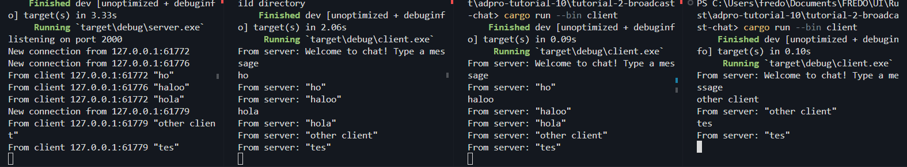
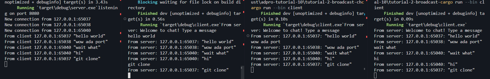

### Broadcast Chat
Screenshot menjalankan 1 server dan 3 client


Untuk menjalankannya, buka 4 terminal terlebih dahulu. Jalankan perintah berikut pada 1 terminal yang akan berperan menjadi server
```bash
cargo run --bin server
```
Kemudian jalankan perintah berikut pada 3 terminal yang akan berperan menjadi client.
```bash
cargo run --bin client 
```

Untuk mengubah port dari 2000 menjadi 8080, ganti potongan kode berikut pada `src/client.rs` dan `src/server.rs`
```rust
// src/client.rs
ClientBuilder::from_uri(Uri::from_static("ws://127.0.0.1:2000")) // before
ClientBuilder::from_uri(Uri::from_static("ws://127.0.0.1:8080")) // after

// src/server.rs
let listener = TcpListener::bind("127.0.0.1:2000").await?; // before
let listener = TcpListener::bind("127.0.0.1:8080").await?; // after
```
Server mendengarkan menggunakan TCP sementara client membuat koneksi menggunakan websocket. Hal ini dapat dilakukan karena lapisan transportasi yang mendasari websocket sebenarnya adalah TCP.

Untuk mengeluarkan output tentang sender, maka ubahlah `src/server.rs` pada line berikut:
```rs
// before
let client_info = format!("{text:?}");
bcast_tx.send(client_info)?;

// after
let client_info = format!("{addr:?}: {text:?}");
bcast_tx.send(client_info)?;
```
Perubahannya adalah penambahan `{addr:?}:` pada string yang kemudian akan di-boradcast ke seluruh client. Berikut adalah screenshot hasilnya:

